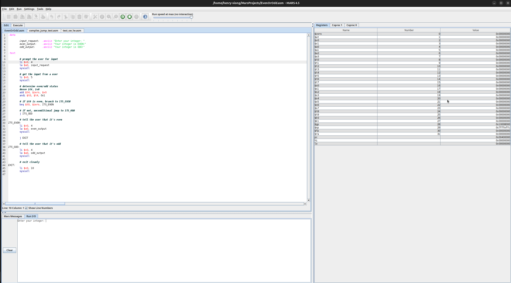
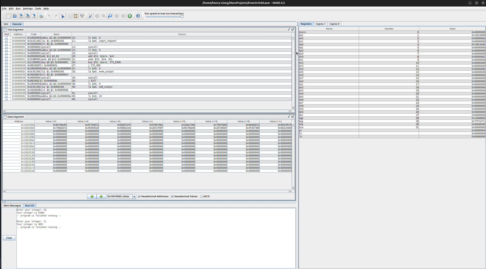
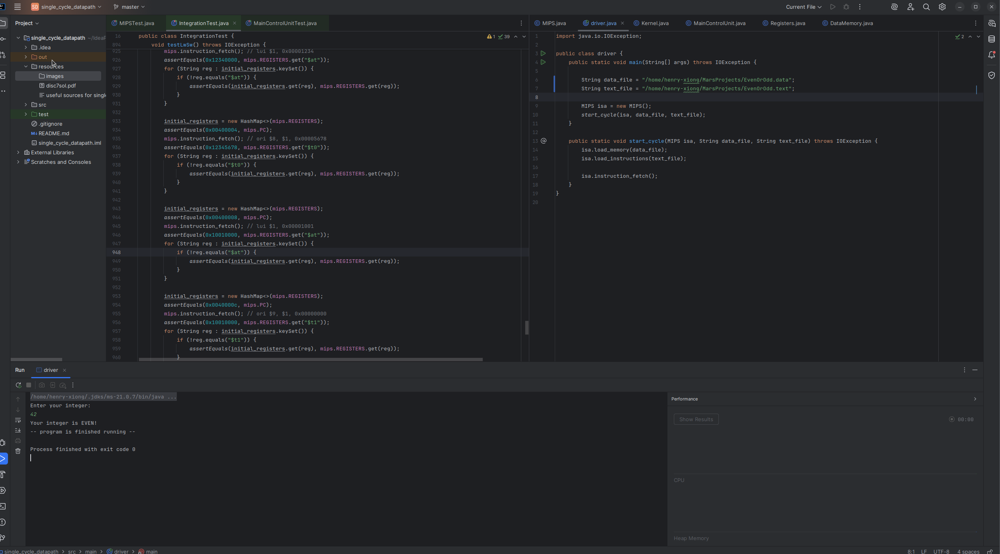
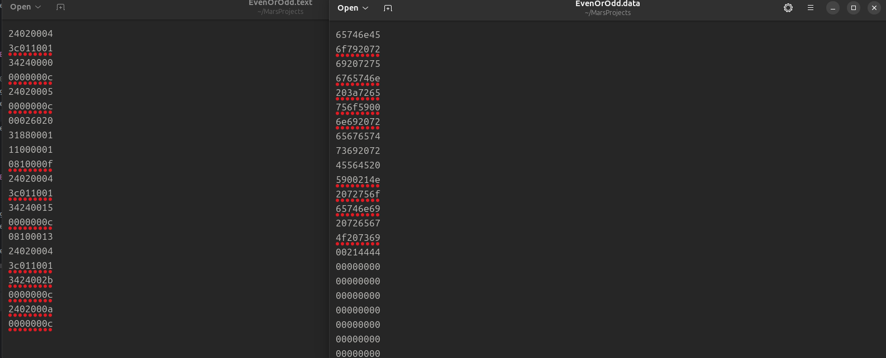

# Reduced Instruction Set MIPS Simulator
___

## Introduction
This Java program that will take MIPS machine code instructions (reduced) and simulate the internal workings of a MIPS processor using a single-cycle datapath. 

+ add
+ addi
+ addiu
+ and
+ andi
+ beq
+ bne
+ j
+ jr
+ jal
+ lui
+ lw
+ or
+ ori
+ slt
+ sub
+ sw
+ syscall
  + print integer
  + print string
  + read integer
  + exit
___
## Output
Provided with the path to the .text and .data file, which will contain a sequence of data represented in ASCII hex format, one word of data per line. The program will read these files, and then simulate execution of the MIPS program, maintaining a representation of the internal MIPS CPU state, including registers and memory including registers and memory simulating the single cycle version of the processor.

The output will be how the program interfaces with the user.
That is, if the following sequence of instructions were executed:

```
addiu $v0, $zero, 1
addiu $a0, $zero, 42
syscall
```

You would print the number 42 to the terminal (prints an integer because the number 1 was put in $v0, and prints 42 specifically because 42 was put in $a0).

___
## Visuals
Here is a sample program in Mars that reads the user's input to check if it's an even or odd number.


This is the output after inputting your own integer, also including the final state.


The output of the program from Mars in the Java simulation.


Lastly, what will be inputted will be the .data and .text file of the instructions.
Left text editor shows the instructions in hexadecimal, and right shows the data in hexadecimal.


___
## Note
MIPS_old.java contains the previous implementation without control signals in the misc_files folder.
